# 数据结构与算法之第一篇.排序算法

最常用的排序算法：

**冒泡排序、插入排序、选择排序、归并排序、快速排序、计数排序、基数排序、桶排序。**

按照时间复杂度可分为三类：

|     排序算法     | 时间复杂度 | 是否基于比较 |
| :--------------: | :--------: | :----------: |
| 冒泡、插入、选择 |  $O(n^2)$  |      Y       |
|    快排、归并    | $O(nlogn)$ |      Y       |
|  桶、计数、基数  |   $O(n)$   |      N       |

# 一、排序算法的三个分析指标

## 1.1 排序算法的执行效率

一般从这几个方面来衡量：

**1. 最好情况、最坏情况、平均情况时间复杂度**

要分别给出最好情况、最坏情况、平均情况下的时间复杂度，并说出最好、最坏时间复杂度对应的要排序的原始数据是什么样的。

区分这三种时间复杂度的目的：

1. 为了方便对比，所以都做一下区分。
2. 要排序的数据，有的接近有序，有的完全无序。我们需要知道排序算法在不同数据下的性能表现。

**2. 时间复杂度的系数、常数 、低阶**

时间复杂度反应的是数据规模 n 很大的时候的一个增长趋势，它会忽略系数、常数、低阶。

但排序的是 1000 以内规模很小的数据，对同阶时间复杂度的排序算法性能对比的时候，应当把系数、常数、低阶也考虑进来。

**3. 比较次数和交换（或移动）次数**

基于比较的排序算法的执行过程，会涉及元素比较大小和元素交换或移动两种操作。

在分析排序算法的执行效率的时候，应该把比较次数和交换（或移动）次数也考虑进去。

## 1.2 排序算法的内存消耗

算法的内存消耗可以通过空间复杂度来衡量。

**原地排序（Sorted in place）**算法，是特指空间复杂度是 O(1) 的排序算法。


## 1.3 排序算法的稳定性

**稳定性**是指如果待排序的序列中存在值相等的元素，经过排序之后，相等元素之间原有的先后顺序不变。

比如有一组数据 2，9，3，4，8，3，按照大小排序之后是 2，3，3，4，8，9。

这组数据里有两个 3。经过某种排序算法排序之后，如果两个 3 的前后顺序没有改变，那我们就把这种排序算法叫作**稳定的排序算法**；如果前后顺序发生变化，那对应的排序算法就叫作**不稳定的排序算法**。

**稳定排序算法可以保持金额相同的两个对象，在排序之后的前后顺序不变**

在实际软件开发中，往往要排序的是一组对象，需要按照对象的某个 key 来排序。

比如给电商交易系统中的“订单”排序。订单有两个属性，**下单时间**和**订单金额**。需要按照金额从小到大，如果金额相同则按照下单时间从早到晚，对订单数据排序。

这个问题借助稳定排序算法的解决思路是：先按照下单时间给订单排序，排序完成之后，再用稳定排序算法，按照订单金额重新排序。两遍排序之后，我们得到的订单数据就是按照金额从小到大排序，金额相同的订单按照下单时间从早到晚排序的。

第一次排序之后，所有的订单按照下单时间从早到晚有序了。在第二次排序中，用的是稳定的排序算法，相同金额的订单仍然保持下单时间从早到晚有序。

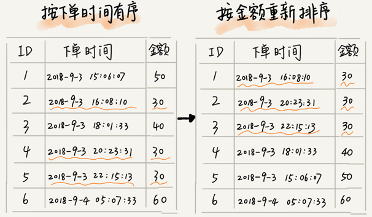

在实际开发中，我对这个问题的解决方案是，把**订单金额**和**下单时间**两个key作为一个自定义的key进行排序。

# 二、时间复杂度O(n^2)​的三种排序算法

## 2.1 冒泡排序（Bubble Sort）

冒泡排序只会操作相邻的两个数据。每次冒泡操作都会对相邻的两个元素进行比较，看是否满足大小关系要求。如果不满足就让它俩互换。一次冒泡会让至少一个元素移动到它应该在的位置，重复 n 次，就完成了 n 个数据的排序工作。

比如对一组数据 $4,5,6,3,2,1$从小到到大进行排序的，第一趟冒泡过程是：

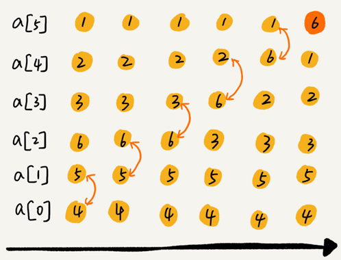

经过一次冒泡操作之后，6 这个元素已经存储在正确的位置上。要想完成所有数据的排序，只要进行 6 次这样的冒泡操作就行了：

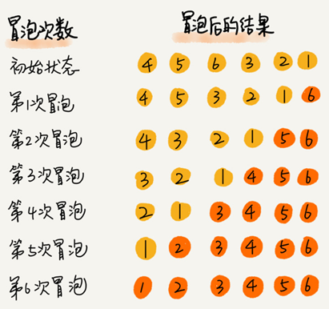

这个冒泡过程还可以优化。当某次冒泡操作已经没有数据交换时，说明已经达到完全有序，不用再继续执行后续的冒泡操作。比如下图给 6 个元素排序，只需要 4 次冒泡操作就可以了：

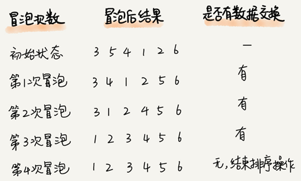

冒泡排序算法的原理比较容易理解，具体的代码我贴到下面，你可以结合着代码来看我前面讲的原理。

python实现：

```python
from typing import List


def bubble_sort(arr: List[int], n: int):
    """冒泡排序，arr是数组,n表示数组长度"""
    if n <= 1: return
    for i in range(n):
        # 提前退出标志位
        flag = False
        for j in range(n - i - 1):
            if (arr[j] > arr[j + 1]):
                arr[j], arr[j + 1] = arr[j + 1], arr[j]  # 交换
                flag = True  # 此次冒泡有数据交换
        if not flag: break
```


### 分析冒泡排序

**第一，冒泡排序是原地排序算法吗？**

冒泡的过程只涉及相邻数据的交换操作，只需要常量级的临时空间，所以它的空间复杂度为 O(1)，是一个原地排序算法。

**第二，冒泡排序是稳定的排序算法吗？**

在冒泡排序中，只有交换才可以改变两个元素的前后顺序。有相邻的两个元素大小相等的时候未做交换，相同大小的数据在排序前后不会改变顺序，所以冒泡排序是稳定的排序算法。

**第三，冒泡排序的时间复杂度是多少？**

最好情况下，要排序的数据已经是有序的了，只需要进行一次冒泡操作，就可以结束了，所以最好情况时间复杂度是 $O(n)$。而最坏的情况是，要排序的数据刚好是倒序排列的，需要进行 n 次冒泡操作，所以最坏情况时间复杂度为 $O(n^2)$。


对于包含 n 个数据的数组，这 n 个数据有 n! 种排列方式。不同的排列方式，冒泡排序执行的时间肯定是不同的。平均时间复杂度就是加权平均期望时间复杂度，如果用概率论方法定量分析冒泡平均时间复杂度，涉及的数学推理和计算就会很复杂。


### “**有序度**”和“**逆序度**”分析平均时间复杂度

**有序度**是数组中具有有序关系的元素对的个数。表达式：

```
有序元素对：a[i] <= a[j], 如果 i < j。
```

比如$2,4,3,1,5,6$这组数据的有序度为11，因为有序对为11个，分别是：
$$
(2,4)\quad(2,3)\quad(2,5)\quad(2,6) \\
(4,5)\quad(4,6)\quad(3,5)\quad(3,6)\\
(1,5)\quad(1,6)\quad(5,6)
$$
对于一个倒序排列的数组，比如 $6,5,4,3,2,1$有序度是 0；

对于一个完全有序的数组，比如$ 1,2,3,4,5,6$有序度就是$n*(n-1)/2$，也就是 15。这种完全有序的数组的有序度叫作**满有序度**。

逆序度的定义正好跟有序度相反（默认从小到大为有序）：

```
逆序元素对：a[i] > a[j], 如果 i < j
```

**逆序度 = 满有序度 - 有序度**。

**排序的过程就是一种增加有序度，减少逆序度的过程，最后达到满有序度，就说明排序完成了。**

比如数组  $4,5,6,3,2,1$有序元素对有 (4，5) (4，6) (5，6)，有序度是 3。n=6排序完成之后满有序度为 n*(n-1)/2=15。

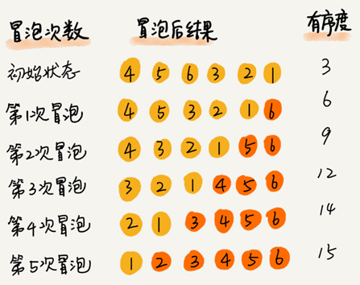

冒泡排序包含两个操作原子，**比较**和**交换**。每交换一次，有序度就加 1。

不管算法怎么改进，交换次数总是确定的，即逆序度，也就是$n*(n-1)/2$–**初始有序度**。上图就是 15–3=12，要进行 12 次交换操作。

对于包含 n 个数据的数组进行冒泡排序，最坏情况下初始状态的有序度是 0，要进行 $n*(n-1)/2$ 次交换。最好情况下，初始状态的有序度是 $n*(n-1)/ 2$，不需要进行交换。可以取个中间值 $n*(n-1)/4$，来表示初始有序度既不是很高也不是很低的平均情况。

平均情况下，需要 $n*(n-1)/4$ 次交换操作，比较操作肯定要比交换操作多，而复杂度的上限是 $O(n^2 )$，所以平均情况下的时间复杂度就是 $O(n^2 )$。

这个平均时间复杂度推导过程其实并不严格，但是很多时候很实用，毕竟概率论的定量分析太复杂，不太好用。


## 2.2 插入排序（Insertion Sort）

一个有序的数组，只要遍历数组找到数据应该插入的位置将其插入，就能继续保持数组有序。


可以通过这种方法保持集合中的数据一直有序，插入排序算法就是采用这种思想来进行排序的：

将数组中的数据分为两个区间，**已排序区间**和**未排序区间**。初始已排序区间只有一个元素，就是数组的第一个元素。取未排序区间中的元素，在已排序区间中找到合适的插入位置将其插入，并保证已排序区间数据一直有序。重复这个过程，直到未排序区间中元素为空，算法结束。

如下图，要排序的数据是 4，5，6，1，3，2，其中左侧为已排序区间，右侧是未排序区间。

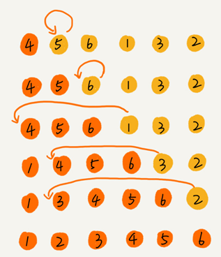

插入排序也包含两种操作，一种是**元素的比较**，一种是**元素的移动**。当我们需要将一个数据 a 插入到已排序区间时，需要拿 a 与已排序区间的元素依次比较大小，找到合适的插入位置。找到插入点之后，我们还需要将插入点之后的元素顺序往后移动一位，这样才能腾出位置给元素 a 插入。

对于一个给定的初始序列，移动操作的次数总是固定的，就等于逆序度。

**移动次数=逆序度**

以下图为例：

满有序度是 $n*(n-1)/2=15$，初始序列的有序度是 5，所以逆序度是 10。而下图数据移动的个数总和也等于 10=3+3+4。

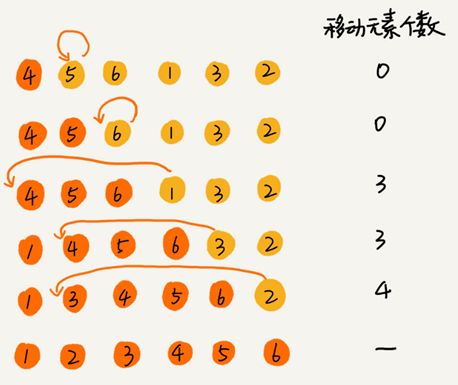

python实现：

```python
def insertion_sort(arr):
    for i in range(1, len(arr)):
        value = arr[i]  # 待插入元素，arr[0:i-1]作为有序序列
        j = i - 1  # j指向有序序列的末端
        while j >= 0 and arr[j] > value:
            arr[j + 1] = arr[j]
            j -= 1
        arr[j + 1] = value # 插入数据
```


### 分析插入排序

**第一，插入排序是原地排序算法吗？**

插入排序算法的运行并不需要额外的存储空间，所以空间复杂度是 O(1)，这是一个原地排序算法。

**第二，插入排序是稳定的排序算法吗？**

在插入排序中，对于值相同的元素，可以选择将后面出现的元素，插入到前面出现元素的后面，这样就可以保持原有的前后顺序不变，所以插入排序是稳定的排序算法。

**第三，插入排序的时间复杂度是多少？**

如果要排序的数据已经是有序的，并不需要搬移任何数据。如果我们从尾到头在有序数据组里面查找插入位置，每次只需要比较一个数据就能确定插入的位置。所以这种情况下，最好是时间复杂度为 O(n)。

如果数组是倒序的，每次插入都相当于在数组的第一个位置插入新的数据，需要移动大量的数据，所以最坏情况时间复杂度为 $O(n^2)$。

在数组中插入一个数据的平均时间复杂度是 $O(n)$。对于插入排序来说，每次插入操作都相当于在数组中插入一个数据，循环执行 n 次插入操作，所以平均时间复杂度为 $O(n^2)$。

## 2.3 希尔排序

希尔排序（Shell Sort），也称递减增量排序算法，是基于插入排序的改进版本（加入了步长）。
基本思想是：
先将整个待排序的记录序列分割成为若干子序列分别进行直接插入排序
待整个序列中的记录"基本有序"时,再对全体记录进行依次直接插入排序。


python实现：

```python
def shell_sort(arr):
    incr = len(arr) // 2
    while incr > 0:
        # i 表示待插入元素角标，arr[0:i:incr]将作为有序序列
        # 例如有序序列角标为{0，incr,2*incr,...,i-incr},待插入元素角标为i,{n*incr}
        for i in range(incr, len(arr), incr):
            key = arr[i]  # 待插入元素，arr[0:i:incr]作为有序序列
            j = i - incr  # j指向有序序列的末端
            while j >= 0 and arr[j] > key:
                arr[j + incr] = arr[j]
                j -= incr
            arr[j + incr] = key
        incr //= 2
```

## 2.4 选择排序（Selection Sort）

选择排序算法也分已排序区间和未排序区间，每次会从未排序区间中找到最小的元素，将其放到已排序区间的末尾。


python代码实现：

```python
def selection_sort(arr):
    for i in range(len(arr) - 1):
        min = i
        for j in range(i + 1, len(arr)):
            if (arr[min] > arr[j]): min = j
        arr[i], arr[min] = arr[min], arr[i]
    return arr
```

### 分析选择排序

**第一，选择排序是原地排序算法吗？**

选择排序算法的运行并不需要额外的存储空间，所以空间复杂度是 O(1)，这是一个原地排序算法。

**第二，选择排序是稳定的排序算法吗？**

选择排序每次都要找剩余未排序元素中的最小值，并和前面的元素交换位置，这样破坏了稳定性。是一种不稳定的排序算法。

比如 5，8，5，2，9 这样一组数据，使用选择排序算法来排序的话，第一次找到最小元素 2，与第一个 5 交换位置，那第一个 5 和中间的 5 顺序就变了，所以就不稳定了。

**第三，选择排序的时间复杂度是多少？**

选择排序总是需要进行(n-1)+(n-2)+...+2+1=n(n-1)/2次比较，所以最好情况时间复杂度、最坏情况和平均情况时间复杂度都为 $O(n^2 )$。


### 为什么插入排序比冒泡排序更受欢迎？

**插入排序和冒泡排序的时间复杂度相同都是 $O(n^2 )$，都是原地排序算法，为什么插入排序比冒泡排序更受欢迎？**

冒泡排序和插入排序，元素交换的次数是一个固定值，是原始数据的逆序度。

但是，从代码实现上来看，冒泡排序需要 1 个复杂的数据交换操作，而插入排序只需要 1 个赋值操作。在java语言上冒泡排序的1个数据交换操作需要3步才能实现：

```java
冒泡排序中数据的交换操作：
if (a[j] > a[j+1]) { // 交换
   int tmp = a[j];
   a[j] = a[j+1];
   a[j+1] = tmp;
   flag = true;
}
 
插入排序中数据的移动操作：
if (a[j] > value) {
  a[j+1] = a[j];  // 数据移动
} else {
  break;
}
```

对同一个逆序度是 K 的数组进行排序。用冒泡排序，需要 K 次交换操作，每次需要 3 个赋值语句，所以交换操作总耗时就是 3*K 单位时间。而插入排序中数据移动操作只需要 K 个单位时间。

所以，理论上来说，冒泡排序相对插入排序一般要多消耗3倍的时间。


## 2.5 三种时间复杂度是 $O(n^2)$ 的排序算法小结

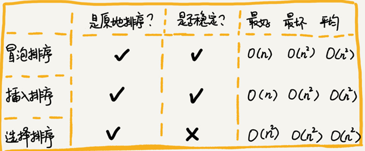


# 三、时间复杂度为 O(nlogn) 的三种排序算法

**归并排序**和**快速排序**是时间复杂度为 O(nlogn) 的排序算法，这两种排序算法适合大规模的数据排序，比时间复杂度为 $O(n^2)$ 的排序算法要更常用。

归并排序和快速排序是两种稍微复杂的排序算法，它们用的都是分治的思想，代码都通过递归来实现，过程非常相似。理解归并排序的重点是理解递推公式和 merge() 合并函数。同理，理解快排的重点也是理解递推公式，还有 partition() 分区函数。

归并排序算法是一种在任何情况下时间复杂度都比较稳定的排序算法，这也使它存在致命的缺点，即归并排序不是原地排序算法，空间复杂度比较高，是 O(n)。正因为此，它也没有快排应用广泛。

快速排序算法虽然最坏情况下的时间复杂度是 $O(n^2  )$，但是平均情况下时间复杂度都是 $O(nlogn)$。不仅如此，快速排序算法时间复杂度退化到 $O(n^2  )$的概率非常小，可以通过合理地选择 pivot 来避免这种情况。

## 3.1 归并排序

归并排序（Merge Sort）的核心思想，如果要排序一个数组，先把数组从中间分成前后两部分，然后对前后两部分分别排序，再将排好序的两部分合并在一起，这样整个数组就都有序了。


归并排序使用的就是**分治思想**。分治，顾名思义，就是分而治之，将一个大问题分解成小的子问题来解决。小的子问题解决了，大问题也就解决了。

分治算法一般都是用递归来实现的。**分治是一种解决问题的处理思想，递归是一种编程技巧**。

归并排序的递推公式：

```c
递推公式：
merge_sort(p…r) = merge(merge_sort(p…q), merge_sort(q+1…r))
 
终止条件：
p >= r 不用再继续分解
```

merge_sort(p…r) 表示，给下标从 p 到 r 之间的数组排序。merge(...)表示分解为merge_sort(p…q) 和 merge_sort(q+1…r)两个子问题再合并，其中下标 q 等于 p 和 r 的中间位置，也就是 (p+r)/2。

当下标从 p 到 q 和从 q+1 到 r 这两个子数组都排好序之后，再将两个有序的子数组合并在一起，这样下标从 p 到 r 之间的数据就也排好序了。

伪代码实现：

```java
// 归并排序算法, A 是数组，n 表示数组大小
merge_sort(A, n) {
  merge_sort_c(A, 0, n-1)
}
 
// 递归调用函数
merge_sort_c(A, p, r) {
  // 递归终止条件
  if p >= r  then return
 
  // 取 p 到 r 之间的中间位置 q
  q = (p+r) / 2
  // 分治递归
  merge_sort_c(A, p, q)
  merge_sort_c(A, q+1, r)
  // 将 A[p...q] 和 A[q+1...r] 合并为 A[p...r]
  merge(A[p...r], A[p...q], A[q+1...r])
}
```

python代码实现：

```python
def merge_sort(arr, p, r):
    if p >= r:
        return
    q = (p + r) // 2
    merge_sort(arr, p, q)
    merge_sort(arr, q + 1, r)
    merge(arr, p, q, r)
```

merge(A[p…r], A[p…q], A[q+1…r]) 的作用是将已经有序的 A[p…q] 和 A[q+1…r] 合并成一个有序的数组，并且放入 A[p…r]。

### merge函数实现方法

申请一个临时数组 tmp，大小与 A[p…r] 相同。用变量 i 和 j分别指向 A[p…q] 和 A[q+1…r] 的第一个元素。比较这两个元素 A[i] 和 A[j]，如果 A[i]<=A[j]就把 A[i] 放入到临时数组 tmp，并且 i 后移一位，否则将 A[j] 放入到数组 tmp，j 后移一位。

继续上述比较过程，直到其中一个子数组中的所有数据都放入临时数组中，再把另一个数组中的数据依次加入到临时数组的末尾，这个时候，临时数组中存储的就是两个子数组合并之后的结果了。最后再把临时数组 tmp 中的数据拷贝到原数组 A[p…r] 中。


 merge() 函数的伪代码：

```c
merge(A[p...r], A[p...q], A[q+1...r]) {
  var i := p，j := q+1，k := 0 // 初始化变量 i, j, k
  var tmp := new array[0...r-p] // 申请一个大小跟 A[p...r] 一样的临时数组
  while i<=q AND j<=r do {
    if A[i] <= A[j] {
      tmp[k++] = A[i++] // i++ 等于 i:=i+1
    } else {
      tmp[k++] = A[j++]
    }
  }
  
  // 判断哪个子数组中有剩余的数据
  var start := i，end := q
  if j<=r then start := j, end:=r
  
  // 将剩余的数据拷贝到临时数组 tmp
  while start <= end do {
    tmp[k++] = A[start++]
  }
  
  // 将 tmp 中的数组拷贝回 A[p...r]
  for i:=0 to r-p do {
    A[p+i] = tmp[i]
  }
}
```

merge()函数的python实现：

```python
def merge(arr, p, q, r):
    i, j, k = p, q + 1, 0  # 初始化变量 i, j, k
    tmp = [0] * (r - p)  # 申请一个大小跟 arr[p:r+1] 一样的临时数组
    while i <= q and j <= r:
        if arr[i] <= arr[j]:
            tmp[k] = arr[i]
            i += 1
        else:
            tmp[k] = arr[j]
            j += 1
        k += 1
    # 判断哪个子数组中有剩余的数据
    start, end = i, q
    if j <= r: start, end = j, r
    # 将剩余的数据拷贝到临时数组 tmp
    while start <= end:
        tmp[k] = arr[start]
        k += 1
        start += 1
    # 将 tmp 中的数组拷贝回 arr[p:r+1]
    for i in range(0, r - p + 1):
        arr[p + i] = tmp[i]
```

### 利用哨兵简化merge函数的编写

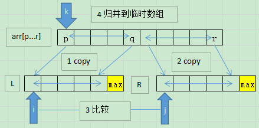

看上图并结合下面的代码，首先把原始数组arr[p…q] copy到临时数组L,原始数组arr[q+1...r]copy到临时数组R

然后分别再临时数组L和R添加哨兵，使用int的最大值保证任何非自己的数都比自己小即可。

然后开始比较L[i]和R[j],取较小值赋值到原始数组，赋值过程中对应的角标都会+1，当i或j移动到尾部max时，由于max永远比其他数要大，所以循环结束后，临时数组L和R不会再有剩余的元素。

带哨兵的merge函数的python实现：

```python
def merge_by_sentry(arr, p, q, r):
    n1, n2 = q - p + 1, r - q  # 表示两个子数组的长度
    # 需要一个位置存储哨兵，所以临时数组长度是 子数组长度+1
    L = [0] * (n1 + 1)
    R = [0] * (n2 + 1)
    # 拷贝数据到临时数组 L[] 和 R[]
    for i in range(0, n1):
        L[i] = arr[p + i]
    L[n1] = sys.maxsize  # 第一个数组添加哨兵（最大值）
    for j in range(0, n2):
        R[j] = arr[q + 1 + j]
    R[n2] = sys.maxsize  # 第二个数组添加哨兵（最大值）
    # 归并临时数组到 arr[l..r]
    i, j, k = 0, 0, p  # 初始化变量 i, j, k
    while k <= r:
        # 当左边数组到达哨兵值时，i不再增加，直到右边数组读取完剩余值，同理右边数组也一样
        if L[i] <= R[j]:
            arr[k] = L[i]
            i += 1
        else:
            arr[k] = R[j]
            j += 1
        k += 1
```


### 归并排序的性能分析

**第一，归并排序是稳定的排序算法吗？**

归并排序在合并的过程中，如果 A[p…m] 和 A[m+1…r] 之间有值相同的元素，可以先把 A[p…m] 中的元素放入 tmp 数组。这样就保证了值相同的元素，在合并前后的先后顺序不变。所以，归并排序是一个稳定的排序算法。

**第二，归并排序的时间复杂度是多少？**

递归代码的时间复杂度可以写成递推公式。

如果定义求解问题 a 的时间是 T(a)，求解问题 b、c 的时间分别是 T(b) 和 T(c)

那就可以得到这样的递推关系式：

```c
T(a) = T(b) + T(c) + K
```

其中 K 等于将两个子问题 b、c 的结果合并成问题 a 的结果所消耗的时间。

假设对 n 个元素进行归并排序需要的时间是 T(n)，那分解成两个子数组排序的时间都是 T(n/2)。而merge() 函数合并两个有序子数组的时间复杂度是 O(n)。所以，归并排序的时间复杂度的计算公式就是：

```c
T(1) = C；   n=1 时，只需要常量级的执行时间，所以表示为 C。
T(n) = 2*T(n/2) + n； n>1
```

进一步分解一下计算过程：

```c
T(n) = 2*T(n/2) + n
     = 2*(2*T(n/4) + n/2) + n = 4*T(n/4) + 2*n
     = 4*(2*T(n/8) + n/4) + 2*n = 8*T(n/8) + 3*n
     = 8*(2*T(n/16) + n/8) + 3*n = 16*T(n/16) + 4*n
     ......
     = 2^k * T(n/2^k) + k * n
     ......
```

通过一步一步分解推导可以得到$T(n) =2^k*T( \frac{n}{2^k})+k*n$。

当 $T(\frac{n}{2^k})=T(1)$ 时，也就是 $\frac{n}{2^k}=1$，得到 $k=log_2n$ 。

将 k 值代入上面的公式，得到 $T(n)=C*n+n*log_2n $。

用大 O 标记法来表示T(n) 就等于 $O(nlogn)$。所以归并排序的时间复杂度是 $O(nlogn)$。

从原理分析和代码来看，归并排序的执行效率与要排序的原始数组的有序程度无关，所以其时间复杂度是非常稳定的，不管是最好情况、最坏情况，还是平均情况，时间复杂度都是 $O(nlogn)$。

**第三，归并排序的空间复杂度是多少？**

归并排序不是原地排序算法。归并排序的合并函数，在合并两个有序数组为一个有序数组时，需要借助额外的存储空间。尽管每次合并操作都需要申请额外的内存空间，但在合并完成之后，临时开辟的内存空间就被释放掉了。在任意时刻，CPU 只会有一个函数在执行，也就只会有一个临时的内存空间在使用。临时内存空间最大也不会超过 n 个数据的大小，所以空间复杂度是 $O(n)$。

### 日志合并题

现在你有 10 个接口访问日志文件，每个日志文件大小约 300MB，每个文件里的日志都是按照时间戳从小到大排序的。你希望将这 10 个较小的日志文件，合并为 1 个日志文件，合并之后的日志仍然按照时间戳从小到大排列。如果处理上述排序任务的机器内存只有 1GB，你有什么好的解决思路，能“快速”地将这 10 个日志文件合并吗？

答：

按照归并排序，归并的思路合并即可，只不过归并排序两两合并，这里是一次性10个一起合并完。

具体方法：

申请一个10个空间的临时数组，每个空间的角标对应一个日志文件，一开始先从10日志文件每个都读取一行数据存入临时对应角标数组中，然后查找这个数组中，时间戳最小的数据，写入文件，然后该角标对应的文件流读一行数据。再循环上述过程，若有文件没有数据可以读，则在临时数组对应位置写入一个会被判断为最大的哨兵数据。若在临时数组中查找到的最小数据也是写入的哨兵数据，则表示所有文件已经全部读取完，处理完毕！

由于内存有1GB，为了充分利用内存，可以把读取流和写入流的缓冲区写大一些。这里我给每个日志文件读取流设置50MB缓冲，写出流设置300MB缓冲共800MB缓冲区。

python代码实现：

```python
# -*- coding: utf-8 -*-
__author__ = 'xiaoxiaoming'

import sys

fs = []
data = []
out = open("out.log", "w", buffering=300 * 1024 * 1024)
for i in range(10):
    fs.append(open("../logs/%s.log" % i, buffering=50 * 1024 * 1024))
    data.append(fs[i].readline().rstrip())

while True:
    min = 0
    for i in range(1, 10):
        if int(data[min]) > int(data[i]):
            min = i
    if data[min] == sys.maxsize: break
    out.write(data[min])
    out.write("\n")
    line = fs[min].readline().rstrip()
    if line:
        data[min] = line
    else:
        data[min] = sys.maxsize

for f in fs:
    f.close()
out.close()
```


## 3.2 快速排序

快速排序算法（Quicksort），简称为“快排”。

快排采用分治的思想，被排序数组中下标从 p 到 r ，选择 p 到 r 之间的任意一个数据作为 pivot（分区点）。

遍历 p 到 r 之间的数据，将小于 pivot 的放到左边，将大于 pivot 的放到右边，将 pivot 放到中间。这样数组 p 到 r 之间的数据就被分成了三个部分，前面 p 到 q-1 之间都是小于 pivot 的，中间是 pivot，后面的 q+1 到 r 之间是大于 pivot 的。


根据分治、递归的处理思想，递归排序下标从 p 到 q-1 之间的数据和下标从 q+1 到 r 之间的数据，直到区间缩小为 1，就说明所有的数据都有序了。

上面的过程的递推公式：

```c
递推公式：
quick_sort(p…r) = quick_sort(p…q-1) + quick_sort(q+1, r)
 
终止条件：
p >= r
```

递归伪代码实现：

```c
// 快速排序，A 是数组，n 表示数组的大小
quick_sort(A, n) {
  quick_sort_c(A, 0, n-1)
}
// 快速排序递归函数，p,r 为下标
quick_sort_c(A, p, r) {
  if p >= r then return
  
  q = partition(A, p, r) // 获取分区点
  quick_sort_c(A, p, q-1)
  quick_sort_c(A, q+1, r)
}
```

partition() 分区函数会随机选择一个元素作为 pivot，然后对 A[p…r] 分区，函数返回 pivot 的下标。

如果不考虑空间消耗的话，partition() 分区函数可以写得非常简单。申请两个临时数组 X 和 Y，遍历 A[p…r]，将小于 pivot 的元素都拷贝到临时数组 X，将大于 pivot 的元素都拷贝到临时数组 Y，最后再将数组 X 和数组 Y 中数据顺序拷贝到 A[p…r]。

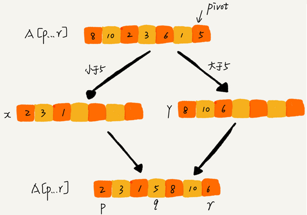

但如果按照这种思路实现partition() 函数就需要很多额外的内存空间，快排就不是原地排序算法了。

如果希望快排是原地排序算法，它的空间复杂度得是 O(1)，那 partition() 分区函数就不能占用太多额外的内存空间，需要在 A[p…r] 的原地完成分区操作。

原地分区函数的伪代码实现思路：

```c
partition(A, p, r) {
  pivot := A[r]
  i := p
  for j := p to r-1 do {
    if A[j] < pivot {
      swap A[i] with A[j]
      i := i+1
    }
  }
  swap A[i] with A[r]
  return i
```

通过 i 把 A[p…r-1] 分成两部分，A[p…i-1] 的元素都是小于 pivot 的，暂且叫它“已处理区间”，A[i…r-1] 是“未处理区间”。每次都从未处理的区间 A[i…r-1] 中取一个元素 A[j]，与 pivot 对比，如果小于 pivot，则将其加入到已处理区间的尾部，也就是 A[i] 的位置。这样可以在 O(1) 时间复杂度内将 A[j] 放到下标为 i 的位置：

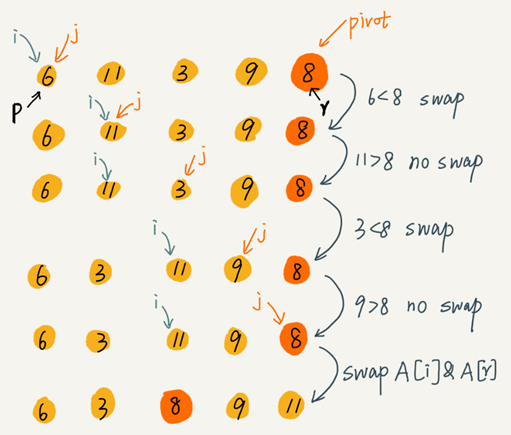

上面的分区的过程涉及交换操作，如果数组中有两个相同的元素，比如序列 6，8，7，6，3，5，9，4，在经过第一次分区操作之后，两个 6 的相对先后顺序就会改变。所以，快速排序并不是一个稳定的排序算法。

python实现代码：

```python
def partition(arr: list, p, r):
    i, pivot = p, arr[r]
    for j in range(p, r):
        if arr[j] < pivot:
            if i != j:
                arr[i], arr[j] = arr[j], arr[i]
            i += 1
    arr[i], arr[r] = arr[r], arr[i]
    return i
```


### 快速排序的性能分析

快排并不占用额外的内存空间，所以快排是一种稳定的排序算法。

快排的分区过程涉及交换操作，相同元素先后顺序会发生改变、所以快排是一种不稳定的排序算法。

如果每次分区操作，都能正好把数组分成大小接近相等的两个小区间，那快排的时间复杂度递推求解公式跟归并是相同的。所以，快排的时间复杂度也是 $O(nlogn)$。

```c
T(1) = C；   n=1 时，只需要常量级的执行时间，所以表示为 C。
T(n) = 2*T(n/2) + n； n>1
```

**但是并不能每次分区操作都正好能将大区间对等地一分为二：**

如果数组中的数据原来已经是有序的了，比如 1，3，5，6，8。每次选择最后一个元素作为 pivot，那每次分区得到的两个区间都是不均等的。需要进行大约 n 次分区操作，才能完成快排的整个过程。每次分区平均要扫描大约 n/2 个元素，这种情况下，快排的时间复杂度就从 $O(nlogn)$ 退化成了 $O(n^2)$。

分区极其均衡和分区极其不均衡，两个极端情况下，分别对应快排的最好情况时间复杂度和最坏情况时间复杂度。

假设每次分区操作都将区间分成大小为 9:1 的两个小区间。套用递归时间复杂度的递推公式：

```c
T(1) = C；   n=1 时，只需要常量级的执行时间，所以表示为 C。
 
T(n) = T(n/10) + T(9*n/10) + n； n>1
```

结论：T(n) 在大部分情况下的时间复杂度都可以做到 $O( nlogn)$，只有在极端情况下，才会退化到 $O(n^2)$。

所以平均情况时间复杂度为$O(nlogn)$

### 快速排序的另一种分区实现

思路：

- 随机选取基准值, 并将基准值替换到数组第一个元素
- 选取第一个元素作为基准值
- 从右向左查找一个比基准值小的元素替换左指针的元素
- 从左向右查找一个比基准值大的元素替换右指针的元素
- 直到左指针与右指针之间没有元素
- 最后左指针与右指针共同指向的位置就是分区点，将分区点的值设置为基准值。

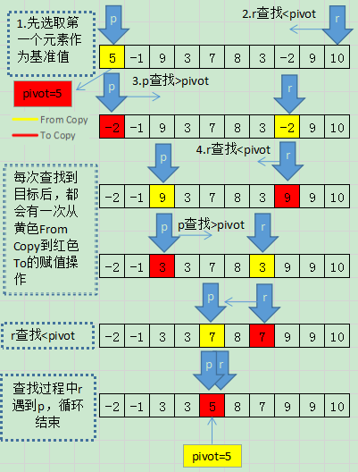

上图中的颜色表示从黄色位置复制到红色位置：

```python
def partition_two_way(arr, p, r):
    # 随机选取基准值, 并将基准值替换到数组第一个元素
    q = random.randint(p, r)
    arr[p], arr[q] = arr[q], arr[p]
    pivot = arr[p]
    while p < r:
        # 从右向左查找比基准值小的位置
        while p < r and arr[r] >= pivot: r -= 1
        arr[p] = arr[r]
        # 从左向右查找比基准值大的位置
        while p < r and arr[p] <= pivot: p += 1
        arr[r] = arr[p]
    arr[p] = pivot
    return p
```

### 快速在无序数组中查找第 K 大元素

快排核心思想就是**分治**和**分区**，利用分区的思想，可以很容易在O(n) 时间复杂度内求无序数组中的第 K 大元素。

思路：

使用任意一种快排的分区函数即可将数组A[0...n-1]分为A[0…q-1]、A[q]、A[q+1…n-1]三部分。

如果 q=K-1，那 A[q] 就是要求解的元素；

如果 q<K-1, 说明第 K 大元素出现在 A[p+1…n-1] 区间，再递归地在 A[p+1…n-1] 这个区间内继续查找。

如果 q>K-1，说明第 K 大元素出现在 A[0…p-1] 区间，再递归地在 A[p+1…n-1] 这个区间内继续查找。


代码实现：

```python
def kth_smallest(arr: list, k: int):
    if len(arr) < k: return -1
    q = partition(arr, 0, len(arr) - 1)
    while q != k - 1:
        if q < k - 1:
            q = partition(arr, q + 1, len(arr) - 1)
        else:
            q = partition(arr, 0, q - 1)
    return arr[q]
```

第一次分区查找，需要遍历 n 个元素执行分区操作。第二次分区查找，只需要遍历 n/2 个元素执行分区操作。

依次类推，分区遍历元素的个数分别为n、n/2、n/4、n/8、n/16.……直到区间缩小为 1。

最差的情况:
$$
由(\frac{1}2)^{m}=\frac{1}n得m=log_{\frac{1}2}\frac{1}n \\故n+\frac{n}2+\frac{n}4+\frac{n}8+…+1=n\cdot(1+\frac{1}2+\frac{1}4+\frac{1}8+...+\frac{1}n) \\=n\cdot\frac{1-\frac{1}2\cdot(\frac{1}2)^{\log_{\frac{1}2}{\frac{1}n}}}{1-\frac{1}2} =2n\cdot (1-\frac{1}2\cdot\frac{1}n)\\=2n-1
$$
所以，上述代码的时间复杂度为 O(n)。


## 3.3 快排和归并的区别

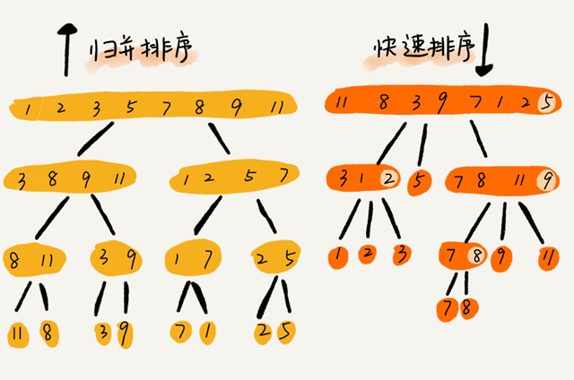

归并排序的处理过程是**由下到上**的，先处理子问题，然后再合并。快速排序的处理过程是**由上到下**的，先分区，然后再处理子问题。

归并排序和快速排序的时间复杂度都为 $O(nlogn)$。

归并排序是稳定的、非原地排序算法，而快速排序是非稳定的原地排序算法。


# 四、时间复杂度为 O(n) 的三种线性排序算法

三种时间复杂度是 O(n) 的排序算法：桶排序、计数排序、基数排序。

因为这些排序算法的时间复杂度是线性的，所以我们把这类排序算法叫作**线性排序**（Linear sort）。

这三个算法都不涉及元素之间的比较操作，是不基于比较的排序算法。

## 4.1 桶排序（Bucket sort）

桶排序核心思想是将要排序的数据分到几个有序的桶里，每个桶里的数据再单独进行排序。桶内排完序之后，再把每个桶里的数据按照顺序依次取出，组成的序列就是有序的了。


桶排序的时间复杂度分析：

如果要排序的数据有 n 个均匀地划分到 m 个桶内，每个桶里就有 k=n/m 个元素。每个桶内部使用快速排序，时间复杂度为 $O(k\cdot\log_{}k)$。m 个桶排序的时间复杂度就是 $O(m\cdot k\cdot logk)$，因为 $k=n/m$，所以整个桶排序的时间复杂度就是 $O(n\cdot log(n/m))$。当桶的个数 m 接近数据个数 n 时，$log(n/m)$ 就是一个非常小的常量，这个时候桶排序的时间复杂度接近 $O(n)$。

桶排序要求要排序的数据需要很容易就能划分成 m 个桶，并且，桶与桶之间有着天然的大小顺序。这样每个桶内的数据都排序完之后，桶与桶之间的数据不需要再进行排序。

其次要求数据在各个桶之间的分布是比较均匀的。如果数据经过桶的划分之后，有些桶里的数据非常多，有些非常少，很不平均，那桶内数据排序的时间复杂度就不是常量级了。在极端情况下，如果数据都被划分到一个桶里，那就退化为 $O(nlogn)$ 的排序算法了。

简易python实现代码：

```python
import math


# m表示桶的个数
def bucket_sort(arr: list, m: int):
    if len(arr) < 2: return
    # 扫描最小值和最大值
    min, max = arr[0], arr[0]
    for i in range(0, len(arr)):
        if arr[i] < min:
            min = arr[i]
        elif arr[i] > max:
            max = arr[i]
    bucket_size = math.ceil((max - min + 1) / m)
    buckets = []
    for i in range(m):
        buckets.append([])
    # 将数组中值分配到各个桶里
    for data in arr:
        bucket_index = (data - min) // bucket_size
        buckets[bucket_index].append(data)
    # 对每个桶进行排序,时间复杂度小于O(nlogn)的排序算法都可以
    k = 0
    for bucket in buckets:
        bucket.sort()
        for data in bucket:
            arr[k] = data
            k += 1


if __name__ == "__main__":
    a3 = [2, 5, 3, 0, 2, 3, 0, 3, 0, 4, 4, 5, 1, 7, 8, 9]
    print(a3)
    bucket_sort(a3, 4)
    print(a3)
```

**桶排序比较适合用在外部排序（数据存储在外部磁盘中）中**：

比如有 10GB 的订单数据，希望按订单金额（假设金额都是正整数）进行排序，但是内存只有几百 MB。

可以先扫描一遍文件，分析订单金额所处的数据范围。假设经过扫描之后订单金额最小是 1 元，最大是 10 万元。将所有订单根据金额划分到 100 个桶里，第一个桶存储金额在 1 元到 1000 元之内的订单，第二桶存储金额在 1001 元到 2000 元之内的订单，以此类推。每一个桶对应一个文件，并且按照金额范围的大小顺序编号命名（00，01，02…99）。

理想的情况下，如果订单金额在 1 到 10 万之间均匀分布，那订单会被均匀划分到 100 个文件中，每个小文件中存储大约 100MB 的订单数据，就可以将这 100 个小文件依次放到内存中，用快排来排序。等所有文件都排好序之后，只需要按照文件编号，从小到大依次读取每个小文件中的订单数据，并将其写入到一个文件中，那这个文件中存储的就是按照金额从小到大排序的订单数据了。

但订单按照金额在 1 元到 10 万元之间并不一定是均匀分布的 ，有可能某个金额区间的数据特别多，针对这些划分之后还是比较大的文件，可以继续划分，比如，订单金额在 1 元到 1000 元之间的比较多，我们就将这个区间继续划分为 10 个小区间，1 元到 100 元，101 元到 200 元，201 元到 300 元…901 元到 1000 元。如果划分之后，101 元到 200 元之间的订单还是太多，无法一次性读入内存，那就继续再划分，直到所有的文件都能读入内存为止。

## 4.2 计数排序（Counting sort）

**计数排序可以理解是桶排序的一种特殊情况**。当要排序的 n 个数据，所处的范围并不大的时候，比如最大值是 k可以把数据划分成 k 个桶。每个桶内的数据值都是相同的，省掉了桶内排序的时间。

比如高考查分数系统排序并计算名次，考生的满分是 900 分，最小是 0 分，这个数据的范围很小，所以可以分成 901 个桶，对应分数从 0 分到 900 分。根据考生的成绩，将这 50 万考生划分到这 901 个桶里。桶内的数据都是分数相同的考生，所以并不需要再进行排序。只需要依次扫描每个桶，将桶内的考生依次输出到一个数组中，就实现了 50 万考生的排序。因为只涉及扫描遍历操作，所以时间复杂度是 O(n)。

**计数排序算法的简单实现：**

假设只有 8 个考生，分数在 0 到 5 分之间。这 8 个考生的成绩放在一个数组 A[8] 中，它们分别是：2，5，3，0，2，3，0，3。

考生的成绩从 0 到 5 分，可以使用大小为 6 的数组 C[6] 表示桶，其中下标对应分数，C[6]内存储对应的考生个数。


然后只需要将C[6]数组的数据展开遍历赋值回A[8]，A[8]中的数据就是有序的了。

python实现代码：

```python
from typing import List

# 对每个分数进行计数
def get_counts(arr: List[int]) -> List[int]:
    counts = [0] * (max(arr) + 1)
    for num in arr:
        counts[num] += 1
    return counts

# 简单的计数排序
def counting_sort_simple(arr: List[int]):
    if len(arr) <= 1: return
    counts = get_counts(arr)
    k = 0
    for i in range(len(counts)):
        count = counts[i]
        for j in range(count):
            arr[k] = i
            k += 1
```

**计数排序的复杂实现方法：**

对 C[6] 数组顺序求和，C[k] 里存储小于等于分数 k 的考生个数，可以快速计算出每个分数的考生在有序数组中对应的存储位置 ：


python代码：

```python
def get_sum_counts(arr: List[int]) -> List[int]:
    counts = [0] * (max(arr) + 1)
    for num in arr:
        counts[num] += 1
    for num in range(1, len(counts)):
        counts[num] += counts[num - 1]
    return counts
```

遍历数组A，对于被遍历的数据去数组C中取出对应角标的值，比如遍历到3时，从数组C中取出角标为3的值7。然后把被遍历的数据放入临时数组R角标为7-1的位置中，数组C中对应角标位置的值减1。

遍历数组A的过程中，当第二次遍历到3时，就会把它放入临时数组 R 中的角标为 6 -1的位置，遍历完整个数组 A 后，临时数组 R 内的数据就是有序排列的了。

如果要求计数排序是稳定的排序算法，则对数组A必须倒序遍历，因为数组C中先取出的是相同元素中最后一个元素的位置，倒序遍历数组A，则可以使用数组A后面的元素先插入临时数组R。

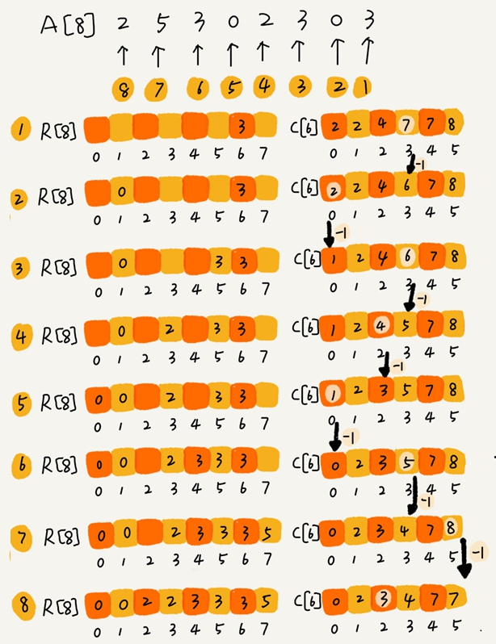

python实现代码：

```python
from typing import List


# 便于获得指定数值的在有序数组中对应的存储位置
def get_sum_counts(arr: List[int]) -> List[int]:
    counts = [0] * (max(arr) + 1)
    for num in arr:
        counts[num] += 1
    for num in range(1, len(counts)):
        counts[num] += counts[num - 1]
    return counts


# 计数排序
def counting_sort(arr: List[int]) -> List[int]:
    n = len(arr)
    if n <= 1: return arr
    counts = get_sum_counts(arr)
    r = [0] * n
    # 遍历数组arr，对于被遍历的数据去数组C中取出对应角标的值，比如遍历到3时，从数组C中取出角标为3的值7。
    # 然后把被遍历的数据放入临时数组R角标为7-1的位置中，数组C中对应角标位置的值减1。
    for i in range(len(arr), -1, -1):
        data = arr[i]
        r[counts[data] - 1] = data
        counts[data] -= 1
    return r
```


总之，**计数排序只能用在数据范围不大的场景中，如果数据范围 k 比要排序的数据 n 大很多，就不适合用计数排序了。而且，计数排序只能给非负整数排序，如果要排序的数据是其他类型的，要将其在不改变相对大小的情况下，转化为非负整数。**

比如，考生成绩精确到小数后一位，就需要将所有的分数都先乘以 10，转化成整数，然后再放到 9010 个桶内。再比如，如果要排序的数据中有负数，数据的范围是 [-1000, 1000]，那我们就需要先对每个数据都加 1000，转化成非负整数。

## 4.3 基数排序（Radix sort）

基数排序对要排序的数据是有要求的，需要可以分割出独立的“位”来比较，而且位之间有递进的关系，如果 a 数据的高位比 b 数据大，那剩下的低位就不用比较了。除此之外，每一位的数据范围不能太大，要可以用线性排序算法来排序，否则，基数排序的时间复杂度就无法做到 O(n) 了。

例如，希望将 10 万个手机号码从小到大排序，要比较两个手机号码 a，b 的大小，如果在前面几位中，a 手机号码已经比 b 手机号码大了，那后面的几位就不用看了。但如果要求是稳定的排序算法，可以先按照最后一位来排序手机号码，然后，再按照倒数第二位重新排序，以此类推，最后按照第一位重新排序。经过 11 次排序之后，手机号码就都有序了。

根据每一位来排序，可以用桶排序或者计数排序，如果要排序的数据有 k 位，最大需要 k 次桶排序或者计数排序，总的时间复杂度是 O(k*n)。当 k 不大的时候，基数排序的时间复杂度就近似于 O(n)。

对于字符串数据，假如要排序的数据并不都是等长的，可以把所有数据补齐到相同长度，位数不够的可以在后面补“0”。

python实现：

```python
def radix_sort(arr):
    max = arr[0]
    for i in range(len(arr)):
        if arr[i] > max:
            max = arr[i]
    max_len = len(str(max))
    # 从个位开始（保证稳定性），对数组每一位都进行一次计数排序
    for i in range(max_len):
        exp = 10 ** i
        arr = counting_sort(arr, exp)
    return arr


def counting_sort(arr, exp):
    if len(arr) <= 1: return
    # 计算每个元素的个数
    counts = [0] * 10
    for i in range(len(arr)):
        counts[(arr[i] // exp) % 10] += 1
    # 计算排序后的位置
    for i in range(1, len(counts)):
        counts[i] += counts[i - 1]
    # 临时数组r，存储排序之后的结果
    r = [0] * len(arr)
    for i in range(len(arr) - 1, -1, -1):
        j = (arr[i] // exp) % 10
        r[counts[j] - 1] = arr[i]
        counts[j] -= 1
    return r
```


## 4.4 根据年龄快速给 100 万用户排序

解决思路：

可以按照计数排序的思路，假设年龄的范围最小 1 岁，最大不超过 120 岁。可以遍历这 100 万用户，根据年龄将其划分到121 个桶里，然后依次顺序遍历这 121 个桶中的元素。这样就得到了按照年龄排序的 100 万用户数据。

python实现：

```python
# 桶排序
def quick_user_sort_by_age(user_list: list, fn=lambda x: int(x)):
    n = len(user_list)
    if n <= 1: return user_list
    # 便于获得指定数值的在有序数组中对应的存储位置
    buckets = []
    for i in range(121):
        buckets.append([])
    for data in user_list:
        buckets[fn(data)].append(data)
    k = 0
    for bucket in buckets:
        for data in bucket:
            user_list[k] = data
            k += 1
```


# 五、如何选择合适的排序算法？

|          |      时间复杂度      | 是稳定排序？ | 是原地排序？ |
| :------: | :------------------: | :----------: | :----------: |
| 冒泡排序 |       $O(n^2)$       |      Y       |      Y       |
| 插入排序 |       $O(n^2)$       |      Y       |      Y       |
| 选择排序 |       $O(n^2)$       |      N       |      Y       |
| 快速排序 |      $O(nlogn)$      |      N       |      Y       |
| 归并排序 |      $O(nlogn)$      |      Y       |      N       |
| 计数排序 | $O(n+k)$ k是数据范围 |      Y       |      N       |
|  桶排序  |        $O(n)$        |      Y       |      N       |
| 基数排序 |   $O(dn)$  d是维度   |      Y       |      N       |

如果对小规模数据进行排序，可以选择时间复杂度是 $O(n^2 )$ 的算法；如果对大规模数据进行排序，时间复杂度是 $O(nlogn)$ 的算法更加高效。所以，为了兼顾任意规模数据的排序，一般都会首选时间复杂度是 $O(nlogn)$ 的排序算法来实现排序函数。

归并排序并不是原地排序算法，空间复杂度是 O(n)。所以，粗略点、夸张点讲，如果要排序 100MB 的数据，除了数据本身占用的内存之外，排序算法还要额外再占用 100MB 的内存空间，空间耗费就翻倍了。整体而言快速排序比较适合来实现排序函数。

## 优化快速排序

如果数据原来就是有序的或者接近有序的，每次分区点都选择最后一个数据，那快速排序算法就会变得非常糟糕，时间复杂度就会退化为 $O(n^2)$。实际上，**这种 $O(n^2)$ 时间复杂度出现的主要原因还是因为我们分区点选的不够合理**。

两个比较常用、比较简单的分区算法：

### 1. 三数取中法

从区间的首、尾、中间，分别取出一个数，然后对比大小，取这 3 个数的中间值作为分区点。这样每间隔某个固定的长度，取数据出来比较，将中间值作为分区点的分区算法，肯定要比单纯取某一个数据更好。但是，如果要排序的数组比较大，那“三数取中”可能就不够了，可能要“五数取中”或者“十数取中”。

### 2. 随机法

随机法就是每次从要排序的区间中，随机选择一个元素作为分区点。这种方法并不能保证每次分区点都选的比较好，但是从概率的角度来看，也不大可能会出现每次分区点都选的很差的情况，所以平均情况下，这样选的分区点是比较好的。时间复杂度退化为最糟糕的 $O(n^2)$ 的情况，出现的可能性不大。


快速排序是用递归来实现的，递归要警惕堆栈溢出。为了避免快速排序里，递归过深而堆栈过小，导致堆栈溢出，有两种解决办法：第一种是限制递归深度。一旦递归过深，超过了事先设定的阈值，就停止递归。第二种是通过在堆上模拟实现一个函数调用栈，手动模拟递归压栈、出栈的过程，这样就没有了系统栈大小的限制。